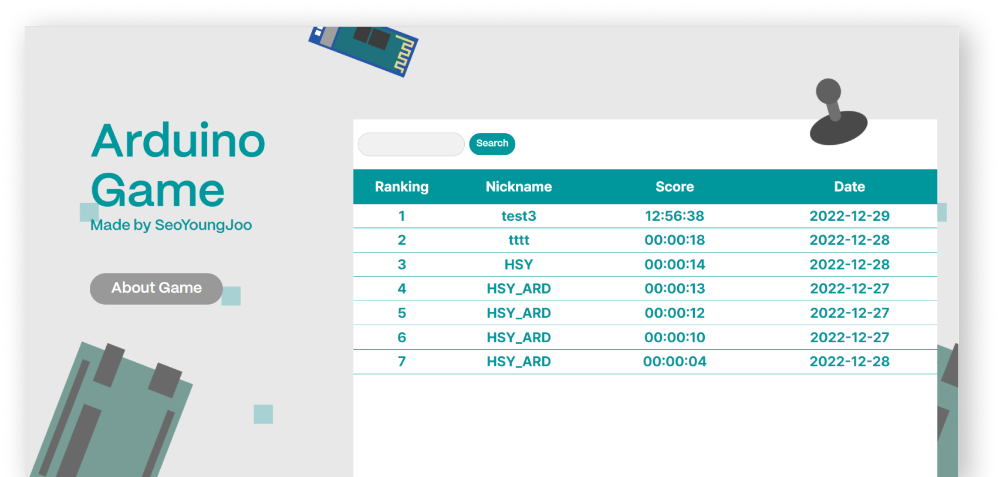

# 💻 장애물 피하기 게임   

> 라즈베리파이와 아두이노의 소켓 통신을 통해 구현한 장애물 피하기 게임 (22.12.23 ~ 22.12.28)

  
 

### 🎞️ <a href="https://player.vimeo.com/video/770017885?h=caac0de6f5&amp;badge=0&amp;autopause=0&amp;player_id=0&amp;app_id=58479">시연영상</a>

 

### 🛠️ 사용 툴 / 언어

    ⚬ Arduino IDE
    ⚬ C++
    ⚬ Arduino (UNO Board, LCD 16x4, 8x8 Matrix, PS2 Joy Stick, Wifi module, Bluetooth module, Power supply module)
    ⚬ Raspberry Pi

### 📘 사용 라이브러리

    ⚬ <MsTimer2.h>
    ⚬ <SoftwareSerial.h>
    ⚬ <LedControl.h>
    ⚬ <Wire.h>
    ⚬ <LiquidCrystal_I2C.h>

### 📌 기능 설명

&nbsp;1. Set Up

<pre>⚬ 시리얼 통신 세팅 
⚬ 블루투스 통신 세팅 
⚬ 움직임을 인식할 타이머 설정 (기본 1초 주기)
</pre>

&nbsp;2. Start

<pre>⚬ 조이스틱을 3초이상 누르면 값을 전송해 게임을 시작하는 기능
</pre>

&nbsp;3. Player Move

<pre>⚬ 타이머를 통해 1초 주기로 사용자의 입력을 읽어오는 기능 
⚬ 조이스틱의 방향에 따라 사용자의 위치를 이동하는 기능 (+ 양쪽 모서리의 경우 움직이지 않도록 예외 처리) 
⚬ 조이스틱 강도에 따라 이동하는 정도를 조절하는 기능 
⚬ 움직임을 읽어 정보 전송하는 기능
</pre>

&nbsp;4. Obstacle Move

<pre>⚬ 장애물 시작 위치를 랜덤으로 설정하는 기능 
⚬ 장애물이 내려오는 시간 설정 기능 (기본 1초 설정) 
⚬ 2칸 크기의 장애물이 정해진 시간을 주기로 한 줄씩 내려오는 기능 
⚬ Player와 마주쳤을 경우 장애물을 없애는 기능 
⚬ Player와 마주치지 않고 끝까지 내려왔을 경우 장애물을 없애는 기능
</pre>

&nbsp;5. End

<pre>⚬ 생명이 0이 되었을 경우 종료하는 기능 
⚬ 플레이한 시간을 Lcd에 표시하는 기능 
⚬ 일정 시간 딜레이 후, 다시 게임 시작 화면을 표시하는 기능 (기본 설정 시간 5초)      
</pre>

### 💡 발전 방향

    ⚬ 난이도를 선택할 수 있는 기능 (속도, 장애물 개수 조절)
    ⚬ 웹에서의 추가기능 구현 (페이징, 동일 아이디 기록 갱신)

### 👩🏻‍🏫 이전 아두이노 게임

    ⚬ https://github.com/dudwn1814/arduinoGame 

### 👩🏻‍💻 개발자

    ⚬ 안영주 - https://github.com/dudwn1814
    ⚬ 황서영 - https://github.com/Seo0H
